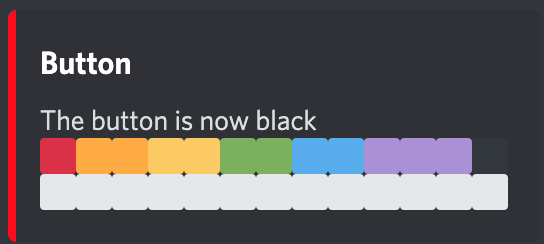

# Discord-bot

Hello this is my discord bot. In quarantine I was really bored so I made this. It is a discord bot with a few functions I liked to made. The bot isn't open for public use. I only use it for a server with my friends. However, I still wanted to share to code with other people. Maybe someone can learn something from it.

---

## Table of content

-   [Tools used](#tools-used)
-   [Commands](#commands)
-   [TODO](#todo)

---

## Tools used

-   [npm.js](https://www.npmjs.com)
-   [node.js](https://nodejs.org/en/)
-   [Visual Studio Code](https://code.visualstudio.com)
-   [discord.js](https://discord.js.org/#/)
-   [keyv.js](https://www.npmjs.com/package/keyv)
-   [rookout](https://www.rookout.com)

---

## Commands

The program reads message from discord as commands. Here is a list of all the commands with a explanation of how they work.

-   [button.js](commands/button.js)
    : This program is inspired by a game on the hermitcraft server. The goal is to get the highest rank. You get a higher rank be pressing sending `R!button press` in discord if the button is on the rank you want. If you use `R!button look` you can see the rank the button on. It will look like this:  Red is of course the highest rank. To start and restart the button use `R!button start`. Each rank has a color so everyone in chat can see which rank you've got. However, make sure that you set the color off the other roles to standard or prioritize the rank roles over the other roles.
-   [duel.js](commands/duel.js)
    : I saw that a lot of discord bots had a duel game, so my bot would have one too. It turned out that it was not as easy as it looked like. However, I made it work and I'm quite proud of how it turned out.
-   [help.js](commands/help.js)
    : help.js is just a command where you can get information about the different commands available to the user.
-   [rombotFace.js](commands/rombotFace.js)
    : This command is still a work in progress. I was bored again so I tried to convert a gif into a message of emojis. I also made it animate by editing the message every second. To activate it type `R!rombot`.
-   [sayHello.js](commands/sayHello.js)
    : sayHello.js is very simple. All it does is sending reply to everybody who says `hello`, `hallo` or `goedendag` (the last two are dutch greeting). I use it to test if the bot is online.

---

## TODO

This project isn't done yet, so i have made a todo list of what wat I still want to add.

-   [ ] Change [rombotFace.js](commands/rombotFace.js), so everyone can make a gif and convert it into emojis.
-   [ ] Make a part in help.js for instructions about [rombotFace.js](commands/rombotFace.js).
-   [ ] Make a few math functions just like most virtual assistance have.
